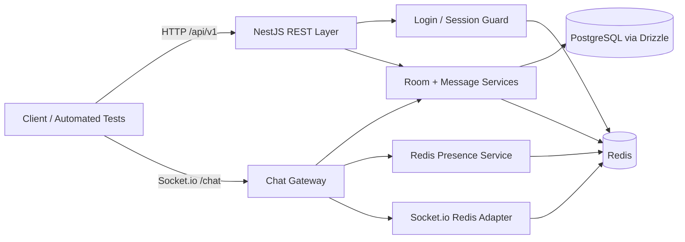

# Architecture Overview

The design keeps each responsibility narrow:

- PostgreSQL is the source of truth for users, rooms, and messages.
- Redis stores sessions, active-user state, socket membership metadata, and pub/sub events.
- NestJS controllers handle the REST contract and envelope formatting.
- The Socket.io gateway handles connection validation and fan-out only.

# Request Flow

1. `POST /login` creates or reuses a user by username.
2. The server creates an opaque session token and stores it in Redis with a 24 hour TTL.
3. REST endpoints require `Authorization: Bearer <sessionToken>` and validate the token against Redis.
4. Socket connections validate the same token plus `roomId` before joining the namespace.
5. Messages are written to PostgreSQL first, then published through Redis so every instance can broadcast them.

# Session Strategy

Sessions are intentionally simple because the product has no password flow.

- Username is the identity anchor.
- Session tokens are opaque random values, not JWTs.
- Redis stores the full session payload with a 24 hour expiry.
- On every REST call and WebSocket connection, the server performs a Redis lookup to confirm the token is still valid.

This keeps the implementation easy to invalidate, easy to scale horizontally, and easy to reason about during an interview.

# Redis Presence Model

Room presence is tracked in Redis, not memory.

- A hash stores active username counts per room.
- A set stores socket IDs currently attached to each room.
- A hash stores per-socket metadata so disconnect cleanup can recover the room and username.

This lets the service survive multiple Node.js instances without relying on local maps. The join/leave paths use atomic Redis increments so presence remains accurate under concurrent connections.

# Pub/Sub and Horizontal Scaling

The HTTP API never emits directly to sockets.

- `POST /rooms/:id/messages` persists the message, then publishes a `message:new` event to Redis.
- `DELETE /rooms/:id` publishes a `room:deleted` event before the row is removed.
- The gateway subscribes to the Redis channel and rebroadcasts to the Socket.io room.
- The Socket.io Redis adapter ensures room broadcasts reach clients connected to other app instances.

This is the key scaling pattern in the project: the REST request writes data once, Redis fans out the event, and every WebSocket node stays in sync.

# Pagination Strategy

Message history is paginated with a cursor based on the last visible message ID.

- Default page size is 50.
- The query cap is 100.
- `before` returns messages older than the referenced message.
- The database query is ordered newest-first so the client can render in reverse chronological order if needed.

The message table includes an index on `(room_id, created_at, id)` to keep the cursor path efficient.

# Estimated Single-instance Capacity

On a modest 1 vCPU / 1 GB deployment, I would expect roughly 1,000 to 2,500 mostly idle WebSocket clients with low chat throughput. The practical ceiling depends on file descriptors, Redis latency, and how often the active-user hash is updated. If the room is very busy, the effective limit drops because the app is doing more Redis and database work per client.

# What I Would Change for 10x Load

1. Split API and WebSocket workloads into independently scaled services.
2. Put PostgreSQL behind a managed database with stronger IOPS and read replicas if needed.
3. Move Redis to a clustered or managed tier and monitor pub/sub fan-out latency.
4. Add response caching for room lists and hot room metadata.
5. Offload very large rooms to a partitioning or sharding strategy if they become hotspots.

# Known Limitations

- Active-user counts are best-effort under abrupt process crashes; graceful disconnects are accurate, but hard failures can leave temporary stale state until cleanup occurs.
- Cursor pagination uses message timestamps plus ID as a stable tiebreaker. It is reliable for the contract, but it is not a globally ordered event log.
- The `room:deleted` event is coordinated through Redis pub/sub, so the behavior is correct across instances, but a partial infrastructure outage can still leave a small window where some clients receive the disconnect slightly later than others.