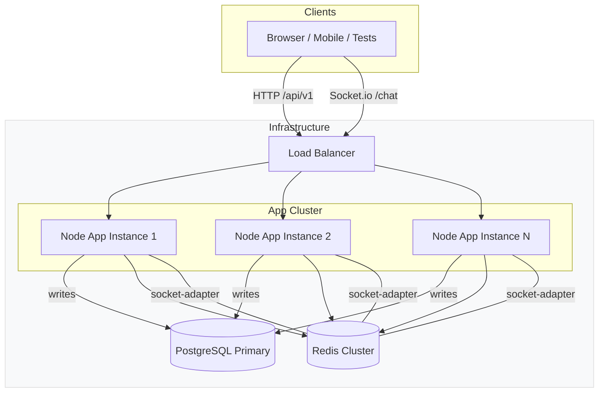

# Architecture Overview

## Message flow (high level)

1. Client posts to `POST /api/v1/rooms/:id/messages` (HTTP)
2. App instance validates session from Redis, writes message to PostgreSQL via Drizzle
3. App publishes `message:new` to Redis pub/sub channel
4. All App instances subscribe to the channel and broadcast to their connected Socket.io clients (Redis adapter ensures cross-instance delivery)

## Operational notes

- Run multiple app instances behind a load balancer to scale WebSocket connections.
- Use Redis for both the Socket.io adapter and for session+presence state to avoid in-memory maps.
- Migrations are managed with `drizzle-kit` and checked-in SQL is available in `drizzle/` for reviewers and CI.

## Diagram usage

Paste the Mermaid block above directly into `ARCHITECTURE.md` or GitHub README to render the diagram.
