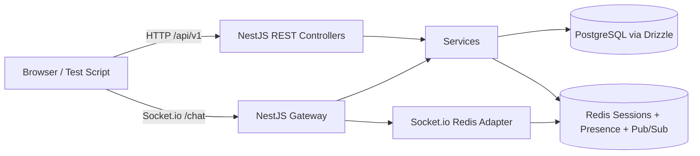

# Architecture Overview

The REST API owns login, room management, and message persistence. Redis stores session tokens, room presence, and pub/sub events. Socket.io handles live chat delivery, while the Redis adapter lets multiple application instances broadcast into the same room namespace.

# Session Strategy

Login is username-only. `POST /login` creates the user on first use, then generates an opaque token and stores a JSON session record in Redis with a 24 hour TTL. The token is returned to the client as `sessionToken` and must be sent as `Authorization: Bearer <sessionToken>` on all REST calls except `/login`.

Session validation reads Redis on every request and every socket connection. Expired tokens disappear automatically when the Redis TTL elapses.

# Redis Pub/Sub Fan-out

`POST /rooms/:id/messages` saves the message in PostgreSQL and then publishes a `message:new` event to Redis. The Socket.io gateway subscribes to the Redis event channel and broadcasts the payload to every socket joined to that room. The same pattern is used for `room:deleted`, which is emitted before the room is removed from the database.

Because the Socket.io server uses the Redis adapter, room broadcasts work across multiple Node.js instances without any in-memory connection registry.

# Estimated Single-instance Capacity

On a typical 1 vCPU / 1 GB container, I would expect roughly 1,000 to 2,500 mostly idle sockets with light chat traffic, assuming PostgreSQL and Redis are external services. The limiting factors are usually file descriptors, memory per socket, and Redis round trips for presence updates. Sustained high message throughput will lower that number.

# Scaling to 10x Load

To handle 10x load, I would:

1. Split the deployment into multiple API/WS instances behind a load balancer.
2. Move PostgreSQL to a managed service with stronger CPU and IOPS, plus tuned indexes on `messages(room_id, created_at, id)`.
3. Use Redis Cluster or a managed Redis tier to reduce pub/sub and presence bottlenecks.
4. Add pagination and caching for room lists and hot message history.
5. Consider sharding very large rooms or offloading historical messages to archival storage.

# Known Limitations

- Presence is accurate for graceful disconnects, but a hard process crash can leave stale Redis counts until TTL or cleanup logic removes them.
- The message cursor is based on message ID plus created-at ordering, which is reliable for this contract but not a perfect global time cursor under all clock-skew scenarios.
- Room deletion broadcasts and disconnects are best-effort across the cluster; the contract path is covered, but recovery after partial infrastructure failure would need additional hardening.