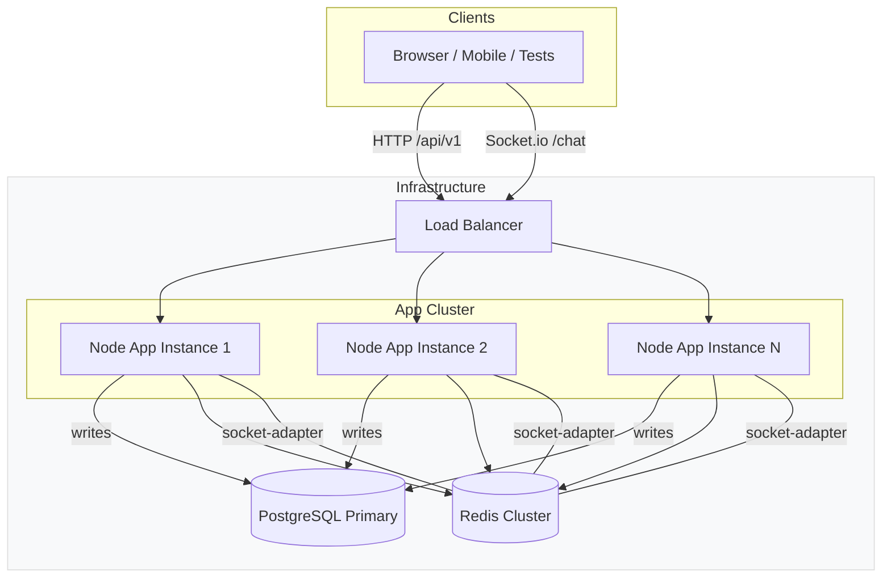

# Architecture Overview

## Message flow (high level)

1. Client posts to `POST /api/v1/rooms/:id/messages` (HTTP)
2. App instance validates session from Redis, writes message to PostgreSQL via Drizzle
3. App publishes `message:new` to Redis pub/sub channel
4. All App instances subscribe to the channel and broadcast to their connected Socket.io clients (Redis adapter ensures cross-instance delivery)

## Operational notes

- Run multiple app instances behind a load balancer to scale WebSocket connections.
- Use Redis for both the Socket.io adapter and for session+presence state to avoid in-memory maps.
- Migrations are managed with `drizzle-kit` and checked-in SQL is available in `drizzle/` for reviewers and CI.

## Diagram usage

Paste the Mermaid block above directly into `ARCHITECTURE.md` or GitHub README to render the diagram.

## Operational details

### Session strategy

- Token format: short opaque session token (UUID v4) returned by `POST /api/v1/login` and stored in Redis as `session:<token>` with a JSON value containing `userId`, `username`, and `createdAt`.
- TTL and renewal: sessions use a 24 hour TTL. On each authenticated HTTP request or WebSocket connection attempt the server refreshes the session TTL (sliding expiration).
- Rotation and invalidation: issue a new token on re-login; support explicit logout which removes the `session:<token>` key. Production deployments should consider HttpOnly, Secure cookies for browser clients instead of query params.
- Validation: the gateway validates tokens on connect by checking Redis; missing or expired tokens are rejected with a `401` socket disconnect event.

### Capacity estimate (guidance)

- Baseline: capacity is highly workload-dependent (message size, broadcast frequency, and middleware cost). Use this guidance for planning only:
  - A single modest Node instance (1 vCPU, 1GB RAM) typically handles thousands of idle Socket.io connections; with sustained message throughput, effective connections decrease.
  - Perform controlled load tests (k6 / Artillery) for your message size and frequency to get realistic numbers for your deployment.

### 10x scaling plan (practical steps)

1. Horizontal scale app instances behind a load balancer (stateless app). Socket.io sticky sessions are NOT required because the Redis adapter handles cross-instance message delivery.
2. Use a managed Redis offering or Redis Cluster for pub/sub and session state. Ensure Redis capacity (clients, memory, and network) scales with connections.
3. Scale Postgres vertically or add read-replicas for read-heavy operations (message history reads). If write throughput grows, partition messages by room (sharding) or migrate hot rooms to separate tables.
4. Add autoscaling rules based on CPU, socket-count, or custom metrics (message rate). Use number of connected sockets and event loop lag as key signals.
5. Introduce cache (Redis) for frequently-read message pages and active-user counts to reduce DB pressure.

### Limitations & trade-offs

- Message ordering across instances: the current design relies on Redis pub/sub which is eventual across subscribers; if strict global ordering is required, add a sequence generator (DB sequence or centralized service).
- At-most-once pub/sub semantics: Redis pub/sub does not persist messages; if consumers are disconnected during a broadcast, they will miss messages. For guaranteed delivery, consider a durable message queue (Kafka, Pulsar) or acknowledgment + history reconciliation.
- Single primary DB for writes: the design favors a single writable Postgres primary. For very high write volumes consider sharding or a write pipeline.
- Security: username-only sessions are intentionally minimal for anonymous usage. For production consider stronger authentication, CSRF protections for web clients, and rate-limiting for endpoints and socket events.

### Deployment & healthchecks

- Health endpoint: implement a `/health` (or `/healthz`) route that checks DB and Redis connectivity and returns `200` when healthy. Use container healthchecks in Docker/Kubernetes.
- Migrations: run `npm run db:push` (or use drizzle migration commands) as part of your deploy pipeline before routing traffic to new instances.
- Secrets: store `DATABASE_URL` and `REDIS_URL` in the host/secret manager. Require they are present before starting the app (Zod validation will enforce this).

