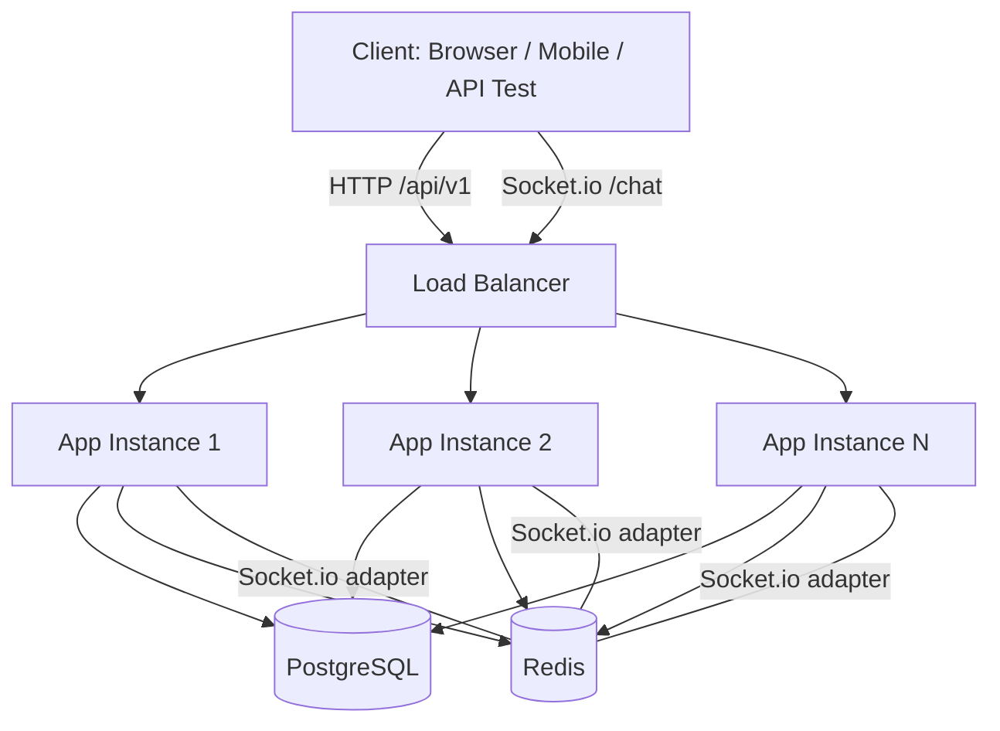

# Architecture Overview

## System Summary

Anonymous Chat API is a NestJS backend for anonymous, room-based chat. The application exposes a REST API for login, room management, and message history, and a Socket.io gateway for real-time updates. PostgreSQL stores durable data such as users, rooms, and messages. Redis stores short-lived session state, active presence counters, and powers pub/sub fan-out between app instances.

The service is intentionally stateless at the application layer so it can be run behind a load balancer and scaled horizontally without changing the client contract.

## High-Level Architecture



## Request Flow

### 1. Login

1. The client sends `POST /api/v1/login` with a username.
2. The server validates the username format.
3. The application looks up the user in PostgreSQL and creates one if it does not exist.
4. A new opaque session token is generated.
5. The token is stored in Redis with a 24-hour TTL.
6. The token and user profile are returned to the client.

### 2. Authenticated HTTP Requests

1. The client includes `Authorization: Bearer <token>`.
2. The session guard reads the token from Redis.
3. If the token is valid, the request continues and the session payload is attached to the request.
4. If the token is missing or expired, the API returns `401 Unauthorized`.

### 3. Real-Time Message Delivery

1. The client submits a message through `POST /api/v1/rooms/:id/messages`.
2. The application validates the session and writes the message to PostgreSQL.
3. The active room presence and routing events are published through Redis.
4. Every running app instance receives the event through the Redis adapter and forwards it to the sockets connected to that instance.

This design keeps the HTTP write path durable while the Socket.io layer remains low-latency and horizontally scalable.

## Component Responsibilities

### NestJS Application

- Hosts the REST API and Socket.io gateway.
- Enforces validation, guards, filters, and a consistent response envelope.
- Remains stateless except for runtime connections.

### PostgreSQL

- Persists users, rooms, and messages.
- Acts as the source of truth for long-term data.
- Supports message history and room metadata queries.

### Redis

- Stores session tokens and session payloads.
- Tracks active-user counts and other ephemeral state.
- Provides pub/sub so all application instances can see the same real-time events.
- Enables Socket.io fan-out across multiple instances.

## Session Strategy

- Token format: the login endpoint returns a short opaque token.
- Storage: the token is stored in Redis under a session key, for example `session:<token>`.
- Payload: the Redis value stores the user identifier, username, and timestamps needed by the application.
- Expiry: sessions expire after 24 hours.
- Validation: every authenticated request and socket connection checks Redis before it is accepted.
- Renewal: the application can refresh the TTL on valid access to keep an active session alive.
- Invalidation: a re-login can issue a new token; logout should delete the Redis key.

This approach is simple, fast, and easy to revoke centrally, which fits an anonymous chat use case well.

## Redis Pub/Sub and WebSocket Fan-Out

Socket.io connections are local to a single Node.js process, but chat events must reach users connected to different app instances. Redis pub/sub solves this by acting as a shared event bus.

When one instance receives a chat event:

1. It persists the event in PostgreSQL if needed.
2. It publishes the event to Redis.
3. The Redis adapter receives the event on all subscribed instances.
4. Each instance emits the event to its own connected sockets.

This means a user connected to instance A can still receive a message produced by instance B without sticky sessions.

## Capacity Estimate for One Instance

The exact number depends on CPU, memory, message size, and how often users broadcast updates.

Reasonable planning guidance for a single modest instance:

- Idle Socket.io connections: often in the low thousands.
- Active chat usage: significantly lower, because each message causes validation, database writes, and fan-out work.
- Practical expectation: a 1 vCPU / 1 GB RAM Node.js instance can usually serve a moderate classroom or small-team workload, but not a high-traffic public chat room without bottlenecks.

The safest answer is that capacity should be measured with a load test such as k6 or Artillery using realistic chat traffic patterns.

## What to Change to Scale to 10x Load

1. Add more app instances behind a load balancer.
2. Keep the app stateless so any instance can handle any request.
3. Move Redis to a managed tier or Redis Cluster if session and pub/sub traffic increases.
4. Scale PostgreSQL vertically first, then add read replicas or partitioning if message history reads become heavy.
5. Cache frequently-read room and message metadata in Redis.
6. Monitor socket count, event-loop lag, Redis memory, and database latency, then autoscale on those signals.
7. Introduce rate limiting and backpressure for abusive or very busy rooms.

## Known Limitations and Trade-Offs

- Redis pub/sub is not durable, so a disconnected subscriber can miss transient broadcast events.
- Message ordering can vary slightly across instances under load.
- The current authentication model is intentionally minimal because the product is anonymous by design.
- Postgres is still the source of truth, so the write path is bound by database throughput.
- Production hardening should add stronger rate limiting, better secret management, and more explicit health checks.

## Local Development Setup

1. Start PostgreSQL and Redis.

```bash
docker compose up -d postgres redis
```

2. Install dependencies.

```bash
npm install
```

3. Create the environment file.

```bash
copy .env.example .env
```

4. Push the schema.

```bash
npm run db:push
```

5. Start the application.

```bash
npm run start:dev
```

## Deployment Notes

- The deployed application is available at `http://31.220.17.72:3000`.
- Use the public GitHub repository for source review and collaboration.
- Before production traffic is routed, make sure environment variables, Redis, and PostgreSQL are ready.
- In containerized deployments, run schema updates as part of the startup or release process.

## API Summary

- `POST /api/v1/login` creates or retrieves an anonymous user and returns a session token.
- `GET /api/v1/rooms` lists rooms for an authenticated session.
- `POST /api/v1/rooms` creates a new room.
- `GET /api/v1/rooms/:id` fetches room details.
- `DELETE /api/v1/rooms/:id` deletes a room.
- `GET /api/v1/rooms/:id/messages` reads message history.
- `POST /api/v1/rooms/:id/messages` sends a message.

## WebSocket Usage

Connect to the Socket.io namespace using the session token and room identifier:

`/chat?token=<sessionToken>&roomId=<roomId>`

Clients can leave a room by sending `room:leave`.

## Reference Files

- `README.md` for local setup and quick start.
- `src/common/filters/api-exception.filter.ts` for API error responses.
- `src/common/interceptors/response-envelope.interceptor.ts` for the standard success envelope.
- `src/common/guards/session.guard.ts` for Redis-backed session validation.
- `src/redis/redis.service.ts` for Redis client usage.
- `src/database/schema.ts` for the PostgreSQL schema.

